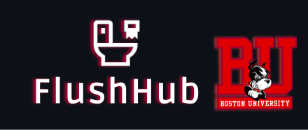
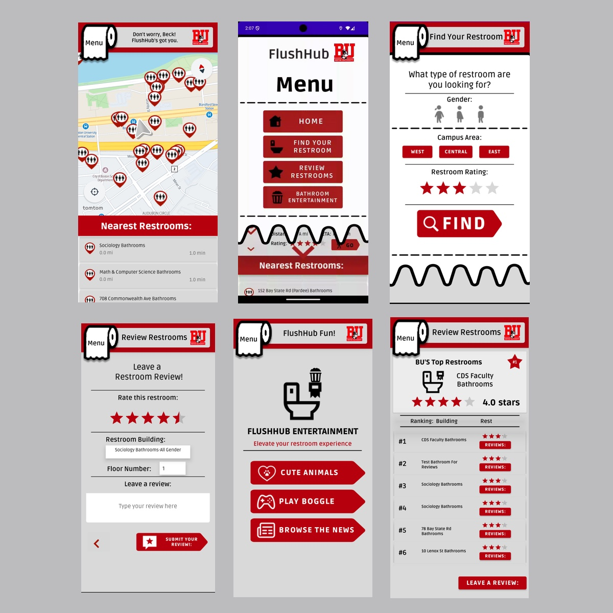

  

Find bathrooms easily on Boston University's campus with custom bathroom searches,reviews, ratings, and entertainment options!
Developed in Kotlin, Android Studio

## Motivation
- **Problem**: Finding the locations and information about bathrooms at Boston University 
- **Purpose**: To provide locations and user reviews of bathrooms to assist students, faculty, and visitors, allowing users to search for bathrooms by gender, campus area, and rating

## Features
- Interactive map showing bathroom locations,routing users to their desired bathroom
- User reviews and ratings for the bathrooms around campus
- Entertainment options including Boggle, cute animal pictures, and categorized news articles
- Multi-language support: Available in English and Thai

## Page Screenshots

## Acknowledgements
- Developed by Beck Sonstein, Aran Pattarachanyakul, and Zachary Gou
- Documentation: [FlushHub Documentation PDF](./FlushHub Documentation.pdf)
  ### Technologies Used
  - TomTom Maps API
  - News API
  - Dictionary API
  - Cataas API
  - Dog CEO API
  - Random Fox API
  - MongoDB 

